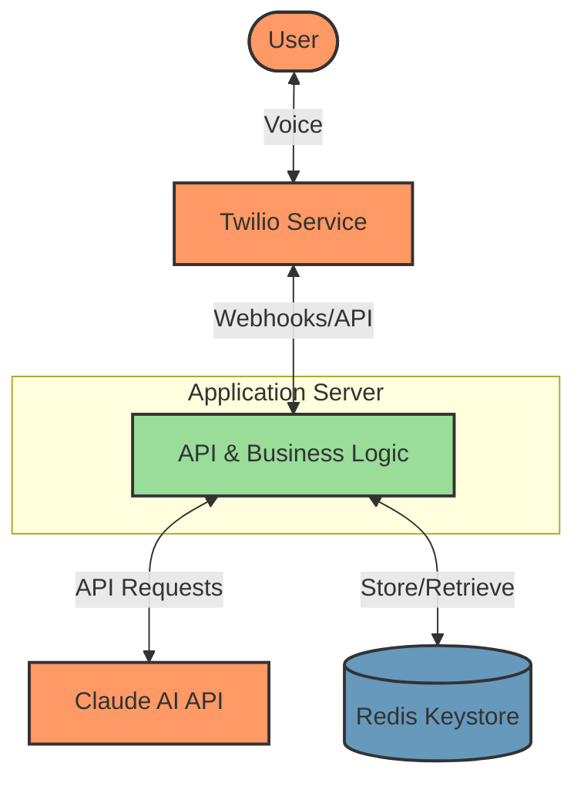

# Try it out!

Call 331-244-7720.

# Setup

## Local

You'll need the following installed locally:

1. `ruby`
2. `bundler`
3. `redis`: key-value datastore

Install dependencies:

```
make install
```

Run the app locally:

```
make local
```

This will start redis locally and spin up a local server at localhost:4567.

## Cloud

You'll need accounts for these services:

1. Twilio: telephony provider
2. Heroku: app cloud hosting

Provision your Heroku instance with a Redis server.

### Deploy

```
make deploy
```

# High-level architecture



# Tech stack choices

* Twilio: Excellent APIs, strong documentation.
* Claude: Low hallucination, strong reasoning, long context window.
	* Chose to pass in Raleigh Water Department FAQ data within the prompt context window not as RAG. This guarnatees data visibility, and has lower latency.
